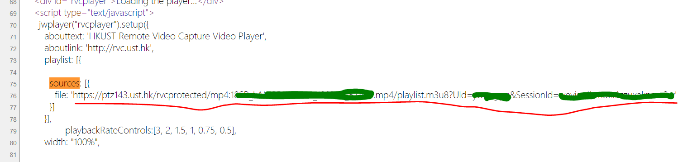

# Auto-download-rvc.ust.hk

## About this project

This project is a modification version of [Auto-download-rvc.ust.hk](https://github.com/firiceguo/Auto-download-rvc.ust.hk), which aims at download HKUST recording videos from @rvc.ust.hk.

## Requirements
- Python 3
- requests (python lib)
- Both Linux and Windows platform systems are supported

## Start
Open "config.py".
 - threads: The number of threads while downloading.
 - save_dir: An **empty** folder which stores the downloaded file. Create if not exists.
 - url: Please go to the corresponding video player page, and find the url from the source code of the page (Ctrl+U for Chrome). The url is like the form `https://ptz141.ust.hk/rvcprotected/mp4:[VIDEONAME].mp4/playlist.m3u8?UId=[ITSCID]&SessionId=[SESSIONID]`. You may search the pattern "sources" to find it.

After editing config file, please type `python downloader.py` to start. If you are sure that all the files are downloaded but failed to merge, you may type `python download.py merge` to skip the download process. 
 
## Modifications
- Change the config file type so users don't need to install configparser.
- Let users provide url instead of login. 
 - The login method seems to be failed now. 
 - Users don't need to install PhantomJS or selenium now.
 - Python3 can be supported in windows version.
 
- Note that both "copy" and "cat" command support multiple combination. We don't need to develop our own method, and there is no error now.
- Bug fixed: `thrVideolist[i].append(Videolist[x:x+1])` -> `thrVideolist[i].append(Videolist[x])`

## Acknowledgement
Thanks for firiceguo's job. Please let me know if you don't want me to modify your code.